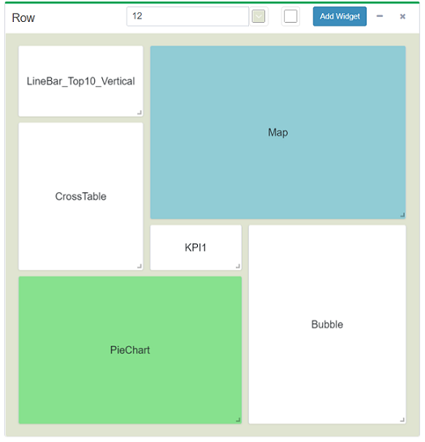

# CBoard-v

## 技术栈
Vue + Vue Router + Vuex + Element-UI

## 新的特性
根据业务的需要，新增了一些特性；  
如可以定制更复杂的布局、调整背景色：  


## 部署
### （前提）Step 0：部署 CBoard 后台
请根据 CBoard 的官方文档部署好完整的项目，确保能访问。  
[CBoard github](https://github.com/TuiQiao/CBoard)  
[安装与配置文档](https://peter_zhang921.gitee.io/cboard_docsify/#/zh-cn/manual/install)

### Step 1: 编译打包 CBoard-v
clone 本项目，  
npm install,  

src/utils/http/api.js 中修改：  
const baseurl = '你的 CBoard 项目访问地址';

npm run build  

生成文件index.html 和目录static

### Step 2: 
将目录 static 加入cboard根目录下，  
将 index.html 改名为 starter.html 替换cboard根目录下原来的文件。

### 开发调试（chrome）
1、config/index.js 中修改： 

```
module.exports = {
  dev: {
    proxyTable: {
        '/api':{
            target: '修改为你的 CBoard 访问地址',
        }
    },

```

2、访问已搭好的 CBoard 项目登录，获得 JSESSIONID 值； 

3、npm install && npm run dev  
使用Chrome浏览器访问页面，在Application中写入Cookie：name 为 "JSESSIONID", value 为上一步获得的值。
刷新即可访问。
